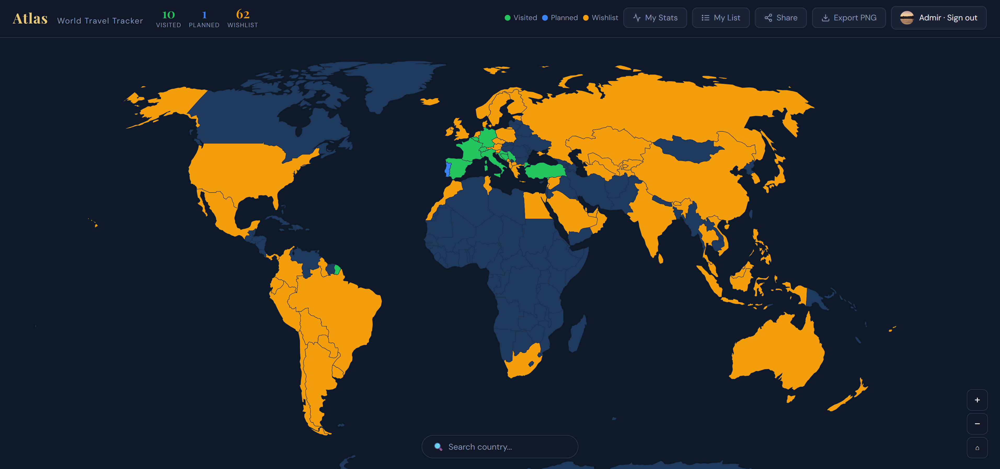

# 🌍 Atlas — World Travel Tracker

🌍 Personal travel tracker. Mark countries as visited, planned or wishlisted and see your journey on an interactive world map.

**[→ Live Demo](https://atlas-tracker-e70d1.web.app)**



---

## Features

- **Interactive world map** — click any country to mark it as visited, planned, or wishlist
- **Stats dashboard** — see your progress by continent, % of world visited, and achievements/badges
- **Country details** — add personal notes, a rating (1–5 stars), and the year you visited
- **Share your map** — generate a public link so friends can view your travel profile
- **Compare with friends** — load a friend's profile and see which countries you've both visited
- **Offline support** — works without internet after first load (PWA with service worker)
- **Google Sign-In** — data synced to the cloud via Firebase, accessible on any device

---

## Tech Stack

| Layer | Technology |
|---|---|
| Frontend | Vanilla HTML, CSS, JavaScript (ES Modules) |
| Map rendering | [D3.js v7](https://d3js.org/) + [TopoJSON](https://github.com/topojson/topojson) |
| Auth | Firebase Authentication (Google Sign-In) |
| Database | Firebase Firestore |
| Hosting | Firebase Hosting |
| PWA | Service Worker + Web App Manifest |

No build tools, no frameworks — runs directly in the browser as a single HTML file.

---

## Getting Started

### 1. Clone the repo

```bash
git clone https://github.com/yourusername/atlas-travel-tracker.git
cd atlas-travel-tracker
```

### 2. Set up Firebase

1. Create a project at [firebase.google.com](https://firebase.google.com)
2. Enable **Firestore** and **Google Authentication**
3. Replace the `firebaseConfig` object in `index.html` with your own config:

```js
const firebaseConfig = {
  apiKey:            "YOUR_API_KEY",
  authDomain:        "YOUR_PROJECT.firebaseapp.com",
  projectId:         "YOUR_PROJECT_ID",
  storageBucket:     "YOUR_PROJECT.firebasestorage.app",
  messagingSenderId: "YOUR_SENDER_ID",
  appId:             "YOUR_APP_ID"
};
```

### 3. Set Firestore Security Rules

In the Firebase Console under **Firestore → Rules**, use:

```
rules_version = '2';
service cloud.firestore {
  match /databases/{database}/documents {
    match /users/{userId}/{document=**} {
      allow read: if true;
      allow write: if request.auth != null && request.auth.uid == userId;
    }
  }
}
```

### 4. Run locally

No build step needed — just open `index.html` in a browser, or use a simple local server:

```bash
npx serve .
```

---

## Project Structure

```
index.html        # Entire app — HTML, CSS, and JS in one file
README.md
```

> The app is intentionally built as a single file for simplicity and portability.
> A natural next step would be splitting it into separate HTML/CSS/JS files
> or migrating to a component-based framework like React.

---

## What I'd do differently next time

- Split into separate CSS and JS files for better maintainability
- Add a proper build pipeline (e.g. Vite) to support environment variables
- Write unit tests for the data logic (country status updates, stats calculation)
- Migrate to React for cleaner component structure

---

## License

MIT — feel free to fork and build your own version.
